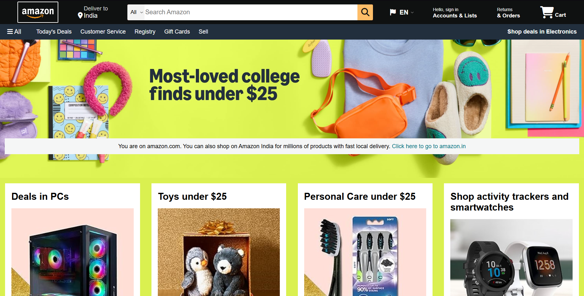

# 🛒 Amazon Clone (HTML & CSS)

A fully responsive and visually appealing clone of the Amazon homepage built using **only HTML and CSS**. This project was created to sharpen frontend skills and practice layout design, responsive styling, and component structuring.



---

## 🚀 Features

- 📦 Clean and responsive design
- 🧭 Fully structured navigation bar
- 🔍 Search bar with icon
- 🛍️ Product sections and categories
- 🧾 Footer with multiple columns
- 💻 Mobile-friendly layout

---

## 🛠️ Built With

- **HTML5**
- **CSS3**

> No JavaScript or frameworks were used — this project focuses purely on frontend styling and layout.

---

## 📁 Project Structure

amazon-clone/
│
├── index.html
├── style.css
├── images
└── README.md

---

## 🎯 What I Learned

- HTML layout structuring (semantic elements, sections, divs)
- CSS styling techniques
- Flexbox and responsive web design
- Design replication from real-world platforms

---

## 📌 How to Use

1. Clone the repository:
   ```bash
    git clone https://github.com/aryandas2911/Amazon-clone.git
   
2. Open index.html in your browser.

---

## ✅ Future Improvements

Add interactivity with JavaScript

Build a functional cart and login system

Use a backend to fetch product data

---

## 🙌 Acknowledgements

Inspired by the original Amazon homepage design.
